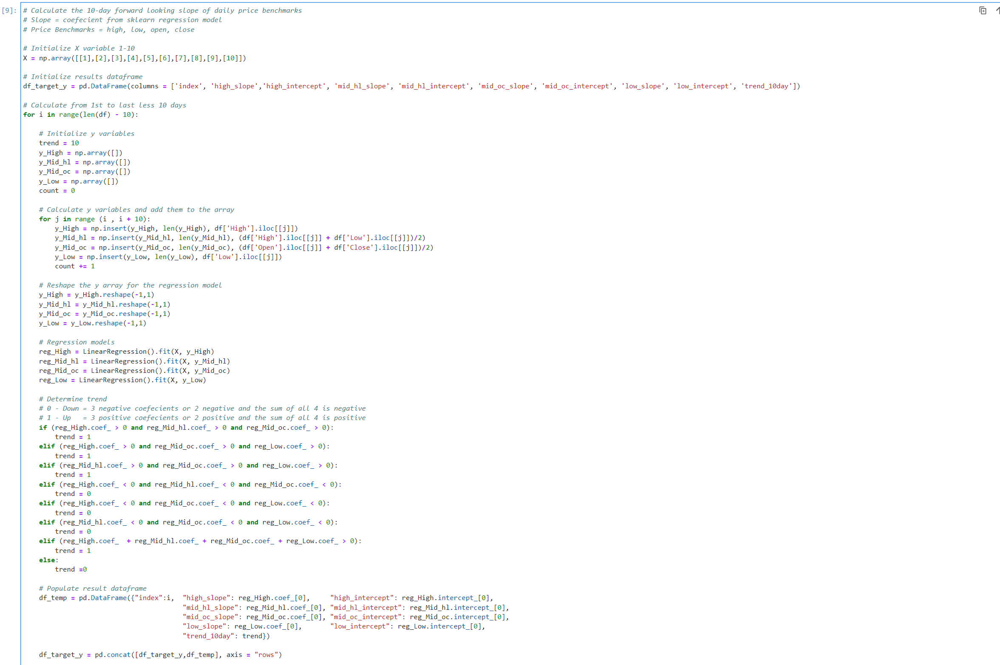

# Project 3 - Predict Weekly Trends of Royal Bank (RY.TO)
# Feature Engineering

  
## Project Overview  
---
Objective: To enhance returns savings accounts through an active trading process that can be executed in all types accounts.    
Approach:  By predicting the weekly trend of Royal Bank (RY.TO)  
  
## Feature Engineering Process  
---  
1. Develope Feature X Variables
    > Feature X varaibles are used when predicting Target Y varibles of another security.  
    > Feature X varaibles are used when creating Target Y varibles for this security.
2. Develop Target Y Variables
    > Target Y Variables are the regression slope of 10-day Price
    > - Various prices are used: 
    >   - Price: High, Low, Open, and Close 
    >   - Average Price: High + Low, Open + Close, and High + Low + Open + Close
    > - Trend Determination  
    >   - Positive Slopes are Up Trends 
    >   - Negative Slopes are down Trends
    > - Classifcation Variables are created by determining the ration of +ve vs. -ve slopes
3. Dataframes are exported to csv files for use in modeling
    > See modeling for how the varius data files are consumed
4. Outputs of the Feature Engineering Process:  
    > - [RY.TO Feature Engineering Jupyter Notebook](Fearure_Engineering_RY_TO.ipynb)  
    > - [RY.TO Feature Engineered CSV File](../Data/Feature_Engineering_RY.csv)  

## Exploratory Data Analysis (RY.TO Variables)  
---
1. Feature X Variables:
    - From Import - 6 Variables
    - Engineered - 18 Variables  
      
2. Daily Prices High and Low:
    - Where both colours are visible demonstrates a highly volitile day  
      
3. Daily Returns:
    - Range primarily between +/- 0.05%  
    - Maximum Range between 0.12% and - 0.21%  
      
4. Standard Deviation:
    - Range primarily up to $2.00  
    - Maximum Range up to $11.00 (covid crash)  
      
5. Target Y Variables:
    - Calculated 4 x 10-Day Daily Price Regression Lines
    - Regressions(4) On: High, Avg High/Low, Avg Open/Close, and Low
    - 10-Day Trend from common direction of slopes (or sum of slopes when 2 each +ve/-ve)  
      
6. Trend - Slope of 10-Day Regression Line for Daily High and Low Price:
    - It is rare that the slopes are in opposite directions
      

## Detailed Feature Engineering Process  
--- 
> Create data files for securities containing source and engineered Feature X and Target Y variables.  

A.  Import Python Libraries   
      
B.  Import Security Prices   
      
C.  Feature Engineering -  Feature X Variables  
    C1. Add Feature X Varibles to a Dataframe   
      
    C2. Display Feature X Variables   
      
    C3. Chart Daily Prices High vs. Low   
      
    C4. Chart Daily Returns   
      
    C5. Chart Standard Deviation   
      
D. Feature Engineering - Target Y variables  
    D1. Prepare Feature X Dataframe to create Target Y variables  
      
    D2. Add Target Y Varibles to a Dataframe     
      
    D3. Display Target Y Variables (10-Day Slope of Prices)
      
    D4. Concatinate Target Y Varibles to Feature X Variables   
      
    D5. Chart 10-Day Slope of Prices   
      
E. Export Data to CSV   
      
  
  
## Feature Engineering Jupyter Notebooks and CSV Files  
---
> Links to Jupyter Notbook and CSV Data files.  

| No. | Jupyter Notebook	                            | CSV File  
| --- | ----------------	                            | -----------  
|  1. | [RY.TO](Fearure_Engineering_RY_TO.ipynb)      | [Royal Bank](../Data/Feature_Engineering_RY.csv)  
| --- | ----------------------                        | -------------------------------------------   
|  2. | [BMO.TO](Fearure_Engineering_BMO_TO.ipynb)    | [Bank of Montreal](../Data/Feature_Engineering_BMO.csv)  
|  3. | [BNS.TO](Fearure_Engineering_BNS_TO.ipynb)    | [ScotiaBank](../Data/Feature_Engineering_BNS.ipynb)  
|  4. | [CM.TO](Fearure_Engineering_CM_TO.ipynb)      | [Bank of Commerce/CIBC](../Data/Feature_Engineering_CM.csv)  
|  5. | [NA.TO](Fearure_Engineering_NA_TO.ipynb)      | [National Bank](../Data/Feature_Engineering_NA.csv)  
|  6. | [TD.TO](Fearure_Engineering_TD_TO.ipynb)      | [TD Bank](../Data/Feature_Engineering_TD.csv)  
| --- | ----------------------                        | -------------------------------------------  
|  7. | [CL.TO](Fearure_Engineering_CL.ipynb)         | [Crude Oil](../Data/Feature_Engineering_CL.csv)  
|  8. | [XGB.TO](Fearure_Engineering_XGB_TO.ipynb)    | [Government Bond Index](../Data/Feature_Engineering_XGB.csv)  
|  9. | [ZEB.TO](Fearure_Engineering_XEB_TO.ipynb)    | [Canadian Bank Index](../Data/Feature_Engineering_ZEB.csv)  
| 10. | [ZWB.TO](Fearure_Engineering_ZWB_TO.ipynb)    | [Canadian Bank Index with Covered Call](../Data/Feature_Engineering_ZWB.csv)  
