# Project 3 - Predict Weekly Trends of Royal Bank (RY.TO)
# Feature Engineering

  
## Project Overview  
---
Objective: To enhance returns savings accounts through an active trading process that can be executed in all types accounts.    
Approach:  By predicting the weekly trend of Royal Bank (RY.TO)  
  
## Machine Learning Model Process  
---  
1. Develope Feature X Variables
    > Feature X varaibles are used when predicting Target Y varibles of another security.  
    > Feature X varaibles are used when creating Target Y varibles for this security.
2. Develop Target Y Variables
    > Target Y Variables are the regression slope of 10-day Price
    > - Various prices are used: 
    >   - Price: High, Low, Open, and Close 
    >   - Average Price: High + Low, Open + Close, and High + Low + Open + Close
    > - Trend Determination  
    >   - Positive Slopes are Up Trends 
    >   - Negative Slopes are down Trends
    > - Classifcation Variables are created by determining the ration of +ve vs. -ve slopes
3. Dataframes are exported to csv files for use in modeling
    > See modeling for how the varius data files are consumed
4. Outputs of the Feature Engineering Process:  
    > - [RY.TO Feature Engineering Jupyter Notebook](Fearure_Engineering_RY_TO.ipynb)  
    > - [RY.TO Feature Engineered CSV File](../Data/Feature_Engineering_RY.csv)  

## Exploratory Data Analysis (RY.TO Variables)  
---
1. Feature X Variables:
    - From Import - 6 Variables
    - Engineered - 18 Variables  
      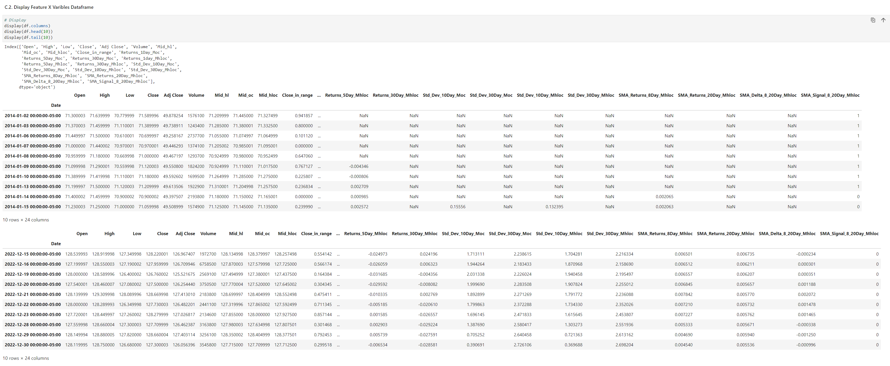
2. Daily Prices High and Low:
    - Where both colours are visible demonstrates a highly volitile day  
      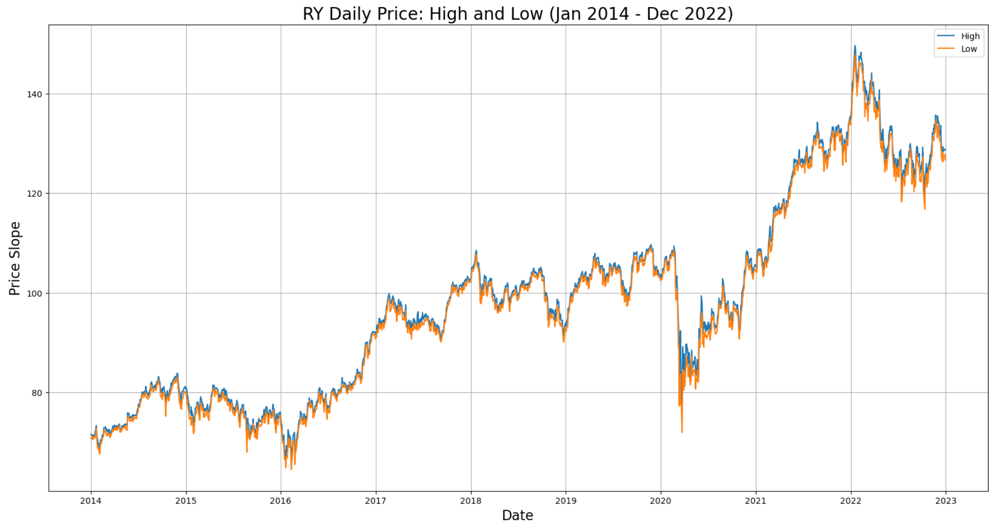
3. Daily Returns:
    - Range primarily between +/- 0.05%  
    - Maximum Range between 0.12% and - 0.21%  
      
4. Standard Deviation:
    - Range primarily up to $2.00  
    - Maximum Range up to $11.00 (covid crash)  
      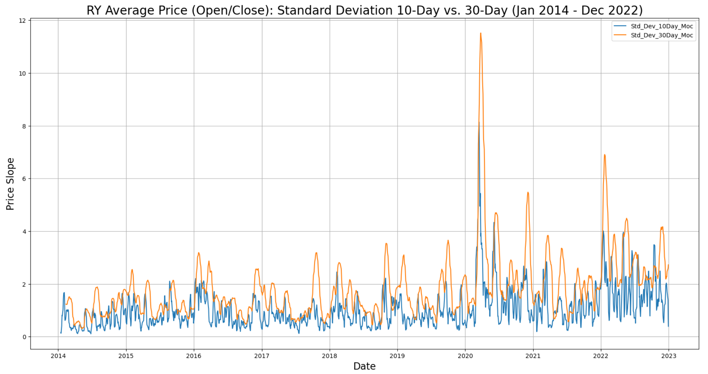
5. Target Y Variables:
    - Calculated 4 x 10-Day Daily Price Regression Lines
    - Regressions(4) On: High, Avg High/Low, Avg Open/Close, and Low
    - 10-Day Trend from common direction of slopes (or sum of slopes when 2 each +ve/-ve)  
      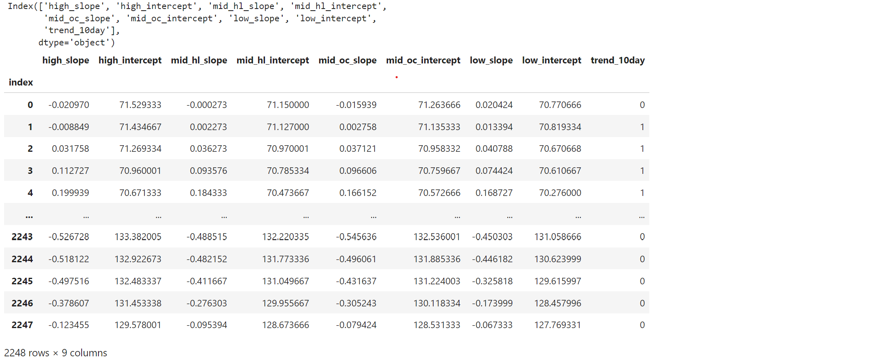
6. Trend - Slope of 10-Day Regression Line for Daily High and Low Price:
    - It is rare that the slopes are in opposite directions
      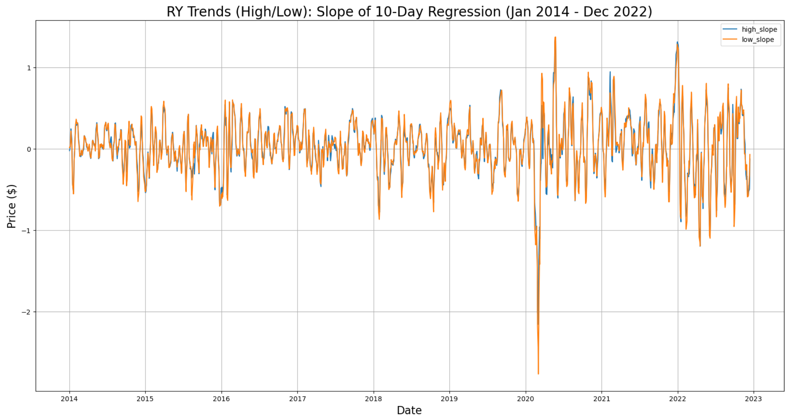

## Detailed Machine Learning Process  
--- 
> Create data files for securities containing source and engineered Feature X and Target Y variables.  
  
1.  Import Python Libraries   
    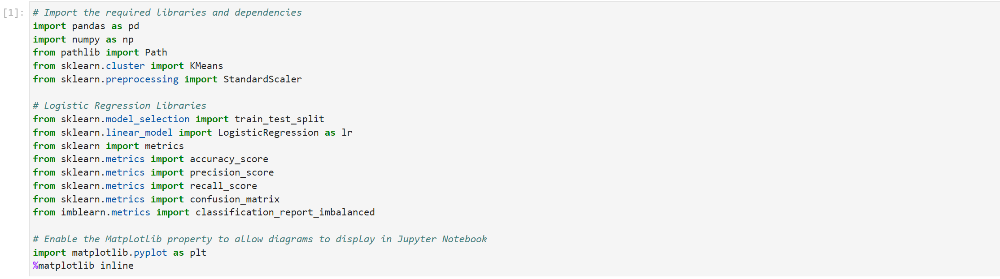  
---    
2.  Import Data   
    1. Import Feature X Data  
        - Import CSV File  
            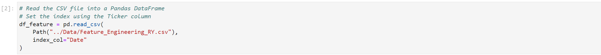  
        - Review CSV Dataframe  
              
        - Remove Target Y Variables  
              
        - Review Feature X Dataframe  
              
    2. Import Target Y Data  
        - Import CSV File  
            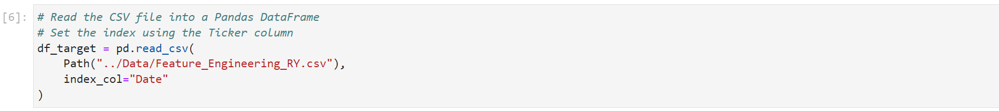  
        - Review CSV Dataframe  
            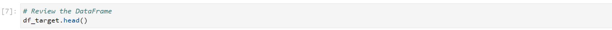  
        - Remove Feature X Variables  
              
        - Review Target Y Dataframe  
            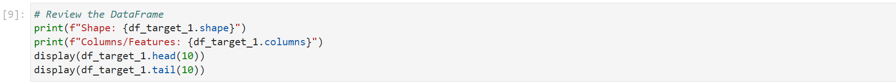  
---
3.  Machine Learning Model 
    1. Create Dataframe for Modeling Process   
        - Concatinate Feature X and Target Y Fataframes   
              
        - Display Modeling Dataframe   
              

    2. Prepare Modeling Data   
        - Split Data into Training and Testing Dataframes   
              
        - Create Training Dataframe   
            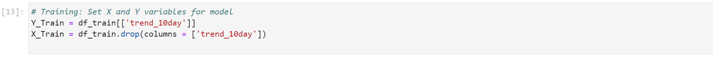  
        - Review Training Dataframe      
            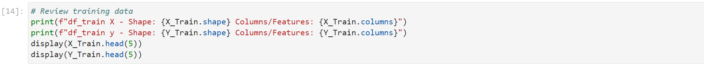  
        - Create Testing Dataframe     
            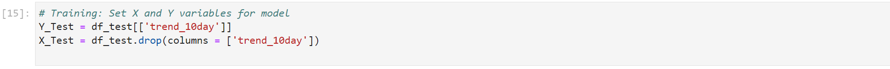  
        - Review Testing Dataframe  
              
        - Convert Target Y datatype from dataframes to series   
            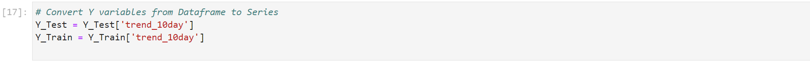  

    3. Create Logistic Regression Model  
        - Create Model  
            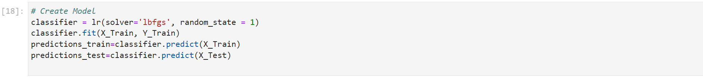  
        - Create Predictions   
              
    
    4. Model Performance  
        - Classifcation Report  
              
        - Confusion Matrix   
              
        - Accuracy Measures   
              
        - Review Predictions  
              
        - Chart Predictions 2018   
              
        - Chart Pridictions April 2018   
              
        - Chart ROC   
              

 
  
## Machine Learning Jupyter Notebooks and CSV Files  
---
> Links to Jupyter Notbook and CSV Data files.  

| No. | Jupyter Notebook	                            | Feature X - CSV File                                        | Target Y - CSV File  
| --- | ----------------	                            | ------------------                                        | -----------------  
|  1. | [RY Predicts RY](ML_RY_Predicts_RY.ipynb)      | [Royal Bank](../Data/Feature_Engineering_RY.csv)            | [Royal Bank](../Data/Feature_Engineering_RY.csv)  
| --- | ----------------------                | -------------------------------------------                 | -------------------------------------------   
|  2. | [BMO Predicts RY](ML_BMO_Predicts_RY.ipynb)    | [Bank of Montreal](../Data/Feature_Engineering_BMO.csv)     | [Royal Bank](../Data/Feature_Engineering_RY.csv)  
|  3. | [BNS Predicts RY](ML_BNS_Predicts_RY.ipynb)    | [ScotiaBank](../Data/Feature_Engineering_BNS.ipynb)         | [Royal Bank](../Data/Feature_Engineering_RY.csv)  
|  4. | [CM Predicts RY](ML_CM_Predicts_RY.ipynb)      | [Bank of Commerce/CIBC](../Data/Feature_Engineering_CM.csv) | [Royal Bank](../Data/Feature_Engineering_RY.csv)  
|  5. | [NA Predicts RY](ML_NA_Predicts_RY.ipynb)      | [National Bank](../Data/Feature_Engineering_NA.csv)         | [Royal Bank](../Data/Feature_Engineering_RY.csv)  
|  6. | [TD Predicts RY](ML_TD_Predicts_RY.ipynb)      | [TD Bank](../Data/Feature_Engineering_TD.csv)               | [Royal Bank](../Data/Feature_Engineering_RY.csv)  
| --- | ----------------------                | -------------------------------------------                 | -------------------------------------------   
|  7. | [CL Predicts RY](ML_CL_Predicts_RY.ipynb)      | [Crude Oil](../Data/Feature_Engineering_CL.csv)             | [Royal Bank](../Data/Feature_Engineering_RY.csv)  
|  8. | [XGB_Predicts_RY](ML_ZWB_Predicts_RY.ipynb)    | [Government Bond Index](../Data/Feature_Engineering_XGB.csv) | [Royal Bank](../Data/Feature_Engineering_RY.csv)  
|  9. | [ZEB_Predicts_RY](ML_ZWB_Predicts_RY.ipynb)    | [Canadian Bank Index](../Data/Feature_Engineering_ZEB.csv)   | [Royal Bank](../Data/Feature_Engineering_RY.csv)  
| 10. | [ZWB_Predicts_RY](ML_ZWB_Predicts_RY.ipynb)    | [Canadian Bank Index with Covered Call](../Data/Feature_Engineering_ZWB.csv)  | [Royal Bank](../Data/Feature_Engineering_RY.csv)  
